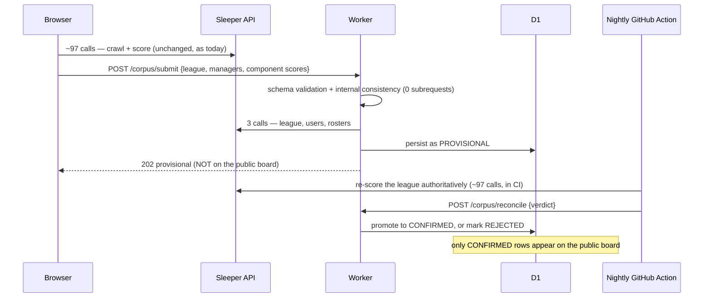

# The cross-league corpus backend

Users type a Sleeper league id into the Manager Score section of the Input
Sleeper Team page and that league is indexed immediately, so managers can be
compared across leagues rather than only within one. This document is the design, the trust model, the abuse
controls, the licensing risk, and the exact steps to switch it on.

It is deliberately blunt about what is *not* proven. Nothing here has been
deployed: there is no Cloudflare account, no `wrangler`, and no D1 database
in the environment this was written in. See §10.

---

## 1. The constraint that dictates the whole design

Scoring one dynasty league costs roughly **97 Sleeper API calls**.
Transactions are paged per week, across every season in the league's history
chain, and a long-running dynasty has many. That number is not a guess — it
is what the existing crawl spends, and `data/cross_league/corpus.json`
records a real run consuming 584 scoring calls for 5 leagues.

Cloudflare Workers cap the subrequests one invocation may make:

| | Workers Free | Workers Paid ($5/mo) |
|---|---|---|
| External subrequests (`fetch` to the internet) | **50** | 1,000 default, [configurable to 10,000](https://developers.cloudflare.com/changelog/post/2026-02-11-subrequests-limit/) |
| Requests/day | 100,000 | no limit |
| CPU time per request | 10 ms | 30 s default, up to 5 min |

So a worker that crawled a league server-side would need ~97 external
subrequests in one invocation and **would fail on the free tier**, roughly
2× over the ceiling. It would fit on paid — but it would also move every one
of those 97 calls from the user's browser onto our infrastructure, which
matters for §7.

### 1.1 A correction to the premise, stated plainly

The brief for this work said "free tier allows ~50 subrequests per request;
paid allows ~1000". The 50 is right but it is specifically **external**
subrequests. Cloudflare's own documentation is inconsistent about the
budget for calls to *its own* services (D1, KV, R2):

* The [Workers changelog][cl] says free plans get "50 external subrequests
  and 1000 subrequests to Cloudflare services" per invocation.
* The [D1 limits page][d1] says "Queries per Worker invocation … 1000
  (Workers Paid) / **50** (Free)".

Those disagree. This design therefore budgets against the **stricter**
reading — as if D1 queries came out of the same 50 — rather than picking the
convenient one. Every endpoint below stays far under 50 counting *everything*.

[cl]: https://developers.cloudflare.com/changelog/post/2026-02-11-subrequests-limit/
[d1]: https://developers.cloudflare.com/d1/platform/limits/

---

## 2. The design: the browser crawls, the worker verifies

Manager Score **already** crawls and scores a league in the browser. It has
always worked that way — Sleeper's API is CORS-friendly, so no proxy
is needed, and this site is a static GitHub Pages build with no server. The
~97 calls already come from the user's own connection.

So:



The worker never crawls. It spends **3 external subrequests** per submission,
against a ceiling of 50.

---

## 3. Endpoint contract

Base URL is the deployed worker, e.g.
`https://dynasty-model-proxy.<subdomain>.workers.dev`.

| Method | Path | Auth | Purpose |
|---|---|---|---|
| POST | `/corpus/submit` | Origin allowlist | Browser submits a scored league |
| GET | `/corpus/leaderboard` | none | Aggregated cross-league board |
| GET | `/corpus/league/<id>` | none | State of one league (UI polling) |
| GET | `/corpus/stats` | none | Counts, caps, limits |
| GET | `/corpus/pending` | Bearer | Leagues awaiting authoritative re-score |
| POST | `/corpus/reconcile` | Bearer | Nightly job's verdict |

The pre-existing `/health`, `/mfl/<year>/export` and `/sleeper/v1/*` proxy
endpoints are unchanged.

### 3.1 `POST /corpus/submit`

Request body, `schema: "dfm.corpus.submission.v1"`:

```json
{
  "schema": "dfm.corpus.submission.v1",
  "league": {
    "league_id": "1316222126914539520",
    "name": "Dallas Kings",
    "season": "2026",
    "n_teams": 12,
    "n_seasons_scored": 4,
    "lineage_ids": ["1316222126914539520", "1182068302871396352"],
    "lineage_root": "970003719653826560"
  },
  "managers": [
    {
      "manager_id": "866789311293566976",
      "display_name": "somehandle",
      "index": 117.2,
      "rank": 1,
      "composite": 1.148,
      "components": {
        "draft":  { "n": 18, "z": 1.604, "mean": 1247.5, "shrunk": 415.83 },
        "trade":  { "n": 3,  "z": 0.562, "mean": 2000.0, "shrunk": 500.0 },
        "waiver": { "n": 9,  "z": 0.997, "mean": 593.5,  "shrunk": 169.57 }
      },
      "flags": []
    }
  ]
}
```

Responses:

| Status | `state` | Meaning |
|---|---|---|
| 202 | `provisional` | Verified against Sleeper, stored, **not public yet** |
| 200 | (current) `duplicate: true` | Submitted recently; current state returned, no upstream cost |
| 400 | `rejected` | Malformed JSON or schema violation |
| 403 | — | Origin not on the allowlist |
| 413 | — | Payload over 64 KB |
| 422 | `rejected` | Internally inconsistent, or failed Sleeper verification |
| 429 | `rejected` | Per-IP rate limit; `Retry-After` set |
| 501 | — | No D1 binding — the backend is not switched on |
| 503 | `rejected` | Global daily cap, or Sleeper unreachable |

### 3.2 `GET /corpus/leaderboard`

Returns **confirmed leagues only** by default. `?include=provisional` adds
client-submitted ones, and the `trust` block in the response always reports
`n_leagues_confirmed` vs `n_leagues_provisional` so a page cannot render the
distinction away.

---

## 4. The trust model

**The client is never trusted.** Scores arrive from a browser and can be
fabricated. Verification is in four stages, cheapest first, so that a bad
submission is rejected before it can cost anything upstream.

### Stage 1 — schema (0 subrequests)

Strict allowlist parsing. Types, ranges, and bounds on everything; unknown
keys are *dropped* rather than rejected, so an older or newer site build is
not a hard failure. League ids must match `^[0-9]{6,24}$`. Manager ids must
be numeric Sleeper user ids — `msBuildInput` invents
`roster:<league>:<n>` placeholders for unowned rosters, and those are refused
because they are not people and cannot be checked against `/league/users`.

Nothing from a payload is ever `eval`'d, passed to `Function`, written to
`innerHTML`, or concatenated into SQL. Every statement is parameterised;
a test asserts that the only thing ever interpolated into a SQL string is a
generated `?, ?, ?` placeholder list.

### Stage 2 — internal consistency (0 subrequests)

This is what makes fabrication *expensive*. The submitted numbers must be
consistent with the scoring model itself:

1. `shrunk == mean × n/(n+k)` for every component, with the real `k`
   (draft 6, trade 3, waiver 5).
2. A component is "live" iff ≥2 managers have evidence in it.
3. Within each live component, the z-scores across managers **with evidence**
   must have mean 0 and population sd 1 — that is what `msZScores` produces.
4. A manager with no evidence in a component must carry `z == 0`.
5. `composite == Σ (renormalised weight × z)`.
6. `index == 100 + 15 × composite`.
7. Ranks are a permutation of 1..N in index order.

A user who edits their own index, or their own z, or scales the whole
distribution, fails one of these. To pass, a forger must reimplement the
entire scoring model — at which point Stage 4 catches them anyway.

### Stage 3 — Sleeper verification (3 external subrequests)

| Call | Checks |
|---|---|
| `GET /v1/league/<id>` | League exists; `settings.type == 2` (dynasty); `total_rosters` matches; season matches |
| `GET /v1/league/<id>/users` | Every claimed `manager_id` really is a member |
| `GET /v1/league/<id>/rosters` | Roster count matches; every claimed manager owns a roster |

`settings.type == 2` is the empirical dynasty marker established in
`docs/CROSS-LEAGUE-CORPUS.md` §3 — a redraft (0) or keeper (1) league is
refused rather than diluted into a dynasty board.

**Display names are taken from Sleeper's response, never from the payload.**
A submission cannot choose how a person is labelled on the board.

If Sleeper is unreachable the result is `transient` — the league is stored
unverified and re-checked later, rather than being branded a forgery
because of an outage.

### Stage 4 — authoritative re-score (the only path to public)

`scripts/reconcile_corpus.py` runs in the nightly GitHub Action. It re-reads
each pending league from Sleeper and re-scores it with **the same shipped
page code the browser ran** (`scripts/js/score_league_harness.js` executing
`MANAGERSCORE_CORE_JS` under node), then compares.

* Agreement within **1.0 index point** → `confirmed`, and the stored numbers
  are replaced with the server's own.
* Disagreement, or a different manager set → `rejected`.
* Unreadable → left pending. An incomplete read must never look like a
  failed audit.

The tolerance cannot be zero: the browser and the nightly job read Sleeper at
different times and price transactions against the KTC artifact as it stood
then, so an honest league legitimately re-scores slightly differently. One
index point is ~0.067 standard deviations.

### 4.1 Status lifecycle

| Status | Set by | On the public board? |
|---|---|---|
| `unverified` | worker, when Stage 3 fails | **No** |
| `provisional` | worker, when Stages 1–3 pass | **No** |
| `confirmed` | nightly job only | **Yes** |
| `rejected` | nightly job, on disagreement | **No** |

A client submission can never reach `confirmed`, and a new client submission
can never demote a league that already is.

---

## 5. Abuse controls, and their limits

A public POST that triggers upstream fetches is an amplification vector.

| Control | Value | Notes |
|---|---|---|
| Origin allowlist | strict on POST | Unlike the read proxy, a foreign origin gets 403 |
| Max body | 64 KB | Checked on `Content-Length` *and* on the actual body, because the header can lie |
| Max managers | 32 | A 12-team payload is ~12 KB |
| Per-IP hourly | 10 submissions | |
| Per-IP daily | 30 submissions | |
| Global daily cap | 500 submissions | Returns 503 + `Retry-After` |
| Dedupe window | 6 hours per league id | Returns 200 with current state; costs **zero** upstream calls |
| Upstream cost of a rejected submission | **0 calls** | Gates and Stages 1–2 all run before any `fetch` |

Rate limits and dedupe are evaluated **before** verification, so a blocked
caller costs one D1 read and no Sleeper traffic at all. Two tests assert
exactly this: a schema-invalid payload and a fabricated payload each make
zero upstream calls.

### 5.1 What these controls do NOT stop

Stated because the owner should not think this is airtight:

* **IP rotation.** Per-IP limits are per-IP. A botnet or a large NAT defeats
  them; the global daily cap is the real backstop, and it is blunt — a
  determined abuser can exhaust it and deny indexing to everyone for a day.
* **A patient forger.** Someone who reimplements the scoring model can pass
  Stages 1–3 for a league they are genuinely in. Stage 4 catches it the next
  night, but the league is in the `include=provisional` view until then.
* **Rate-limit counters are in D1, not a Durable Object.** Under genuinely
  concurrent submissions the increment can race and let a small number
  through over quota. Adequate at this traffic level, not at scale.
* **IP hashing is not anonymity against the operator.** The hash is salted
  and date-scoped so it is useless as a durable identifier, but Cloudflare
  itself still sees the connecting IP.

---

## 6. D1 schema

Full DDL: `scripts/cf-worker/migrations/0001_corpus_init.sql`.

| Table | Holds |
|---|---|
| `leagues` | One row per league: name, season, size, `status`, `verified`, verification notes, submission count, reconcile bookkeeping |
| `managers` | `manager_id` → Sleeper `display_name` only |
| `league_managers` | Per-manager, per-league index, rank, composite, and `n/z/mean/shrunk` for draft, trade and waiver |
| `submissions` | Append-only audit of **every** attempt, accepted and rejected alike |
| `rate_counters` | Hashed-IP and global counters, with expiry |
| `corpus_meta` | Schema version |

Notes:

* `status` carries a `CHECK` constraint and **defaults to `unverified`** — a
  row inserted without an explicit status is not public. Tested.
* `submissions` records rejects. Without them you cannot tell a quiet day
  from a blocked attack.
* No raw IP column exists anywhere. Tested.
* No column for email, real name, username, avatar or phone. Tested.

D1 free tier gives 5 GB per account, 500 MB per database, 10 databases. A
12-team league is ~13 rows; 10,000 indexed leagues is ~120,000 rows. Storage
is a non-issue.

---

## 7. Sleeper licensing — a live risk, in plain language

Sleeper's published terms say the API is **free for non-commercial use**, and
that **commercial use requires contacting them for licensing**. The rate
guidance is to stay **under 1000 calls per minute**.

`docs/CROSS-LEAGUE-CORPUS.md` §2.2 already flags this for the nightly crawl.
This feature moves the exposure, and the owner should understand how.

**The good part.** Because the browser does the crawling, the ~97 calls to
index a league come from the *user's own* connection and IP, exactly as they
already do when someone uses Manager Score today. Our
infrastructure spends **3 calls per submission**. Choosing browser-side
crawling was driven by the subrequest ceiling, but it also keeps our own
Sleeper footprint minimal, and that is a real secondary benefit.

**The risk part, and it is real.** A public endpoint where anyone can type a
league id and have it indexed is closer to operating a *service* on top of
Sleeper's data than a personal analysis project is. The thing being built is
a growing, queryable, public database of Sleeper managers' names and
performance, assembled from their API and served to third parties. That is a
different posture from "I analysed my own league", regardless of who made
the HTTP calls.

Specifically:

1. **Non-commercial today is not non-commercial forever.** If this ever
   carries ads, a subscription, or a paid tier, the non-commercial allowance
   stops applying and Sleeper needs to be asked first. Do not assume it
   carries over.
2. **Volume is bounded but growing.** Nightly re-scoring of every indexed
   league is our own traffic and scales linearly with the corpus. At 100
   indexed leagues that is ~9,700 calls per nightly run. The reconcile job
   is capped (`--limit`, `--max-calls`, `--min-delay-ms`) precisely so this
   cannot quietly become abusive — but the caps must be *raised
   deliberately*, never by default.
3. **A takedown is plausible and should not be a surprise.** Sleeper could
   reasonably object to a public leaderboard of their users' handles. There
   is no contract here, only published terms.

**Recommendation:** before this is publicised beyond personal use — and
certainly before it earns a cent — email Sleeper, describe it accurately,
and ask. It is a short email and it converts an unbounded risk into a known
answer.

---

## 8. Privacy

* Only Sleeper's pseudonymous `display_name` is stored. No attempt is made
  anywhere to resolve a real identity.
* The stored name comes from Sleeper at verification time, never from the
  submitted payload.
* No raw IP is stored. Rate limiting uses `SHA-256(IP + salt + UTC date)`,
  which is useful for a day and useless afterwards.
* No shaming board: the cross-league page ranks and explains, and carries
  the "what this cannot tell you" section already required by
  `docs/CROSS-LEAGUE-CORPUS.md` §8.
* The Manager Score section states, before submission, exactly what will be
  stored, and the opt-in tick box is rendered only when a backend is actually
  configured. Offering a control that does nothing would be a lie in the UI.

People on this board did not ask to be ranked. That is already true of the
nightly crawl; this feature does not make it more true, but it does make the
corpus grow faster, which is worth being deliberate about.

---

## 9. Deploying it — what the owner must do

Nothing in this feature is active until these steps are taken. Until then
the worker keeps proxying exactly as before, `/health` reports
`corpus: "disabled"`, every `/corpus/*` endpoint answers 501 with an
explanation, and the Manager Score section shows no index UI at all.

**None of this is automated, and no credential is committed.** Deployment
uses your own Cloudflare login.

### Step 1 — create the D1 database

```bash
cd scripts/cf-worker
npx wrangler d1 create dynasty-corpus
```

Wrangler prints a `database_id`.

### Step 2 — bind it

Edit `scripts/cf-worker/wrangler.toml`, uncomment the `[[d1_databases]]`
block, and paste the id:

```toml
[[d1_databases]]
binding = "CORPUS_DB"
database_name = "dynasty-corpus"
database_id = "<the id wrangler printed>"
```

### Step 3 — run the migration

```bash
npx wrangler d1 execute dynasty-corpus --remote \
  --file=migrations/0001_corpus_init.sql
```

### Step 4 — set the two secrets

```bash
openssl rand -hex 32          # use the output as RECONCILE_TOKEN
openssl rand -hex 32          # and a different one as IP_HASH_SALT

npx wrangler secret put IP_HASH_SALT
npx wrangler secret put RECONCILE_TOKEN
```

Neither value goes in the repo, in `wrangler.toml`, or in a chat message.

### Step 5 — deploy

```bash
npx wrangler deploy
curl https://dynasty-model-proxy.<subdomain>.workers.dev/health
# expect: {"status":"ok","corpus":"enabled",...}
```

### Step 6 — tell the site where the worker is

In GitHub: **Settings → Secrets and variables → Actions**.

* **Variables** tab → new variable `CORPUS_URL` = the worker URL, no
  trailing slash. (Not secret.)
* **Secrets** tab → new secret `CORPUS_RECONCILE_TOKEN` = the same value you
  gave `wrangler secret put RECONCILE_TOKEN`.

The daily workflow already reads both; see §9.1.

### Step 7 — first run

Push, or run the daily workflow manually. The Manager Score section will then
show the index opt-in, and `scripts/reconcile_corpus.py` will start
promoting verified leagues to `confirmed`.

### 9.1 What the workflow does

`.github/workflows/daily-refresh.yml` gained one step, `Reconcile the
cross-league corpus`, which runs after the existing crawl. It is
`continue-on-error` and exits 0 immediately when `CORPUS_URL` /
`CORPUS_RECONCILE_TOKEN` are unset — so on a repo without the backend
deployed it is a no-op, not a red build.

### 9.2 A stale claim in the existing README, found while doing this

`scripts/cf-worker/README.md` says the site build reads a `PROXY_URL`
environment variable and bakes it into `league.html` as `data-proxy-url`, and
`docs/CHANGELOG-model.md` attributes that to `_build_league_page`.

**Nothing in `src/` reads `PROXY_URL` today.** No such consumer exists in
this tree. That is pre-existing and out of scope here, but it is worth
knowing before following those instructions and expecting the MFL form to
activate. The corpus URL deliberately does **not** reuse that mechanism: it
is read explicitly from `DFM_CORPUS_URL` by `managerscore.manager_score_section`
(the opt-in) and `managerscore.manager_score_corpus_js` (the script), and
there is a test proving both the configured and unconfigured builds.

---

## 10. Verification status — what was and was not proven

### Verified

* `worker.js` parses (`node --check`).
* The migration SQL executes against real SQLite (`python3 sqlite3`,
  in-memory), is idempotent, enforces its `CHECK` constraints, cascades
  deletes, and defaults new rows to a non-public status.
* **The worker's HTTP contract, driven end to end in node** against that same
  schema through a D1-shaped shim over `node:sqlite`
  (`tests/js/corpus_backend_tests.mjs`): submit, leaderboard, league status,
  stats, pending, reconcile, auth, and the no-D1 fallback. The SQL is real
  and runs against real SQLite; only Cloudflare's transport is simulated.
* **Fabrication rejection**, against fixtures produced by running the *real*
  shipped scorer over a synthetic league — not hand-written numbers. Inflated
  index, inflated composite, bumped z, broken shrinkage, shifted or scaled
  distributions, evidence-free managers claiming a z, out-of-order ranks, and
  a wholesale invented payload are each rejected.
* **Payload rejection**: null, array, wrong schema, non-numeric league id,
  SQL-looking league id, absurd team counts, duplicate managers, synthetic
  roster ids, infinities, missing components, negative counts, oversized
  lineage chains, truncated manager sets, oversized bodies (declared *and*
  lying `Content-Length`), and malformed JSON.
* **Abuse controls**: origin rejection, per-IP hourly limit end to end
  (exactly the quota accepted, the rest 429 and audited), dedupe, global cap,
  and that rejected submissions cost **zero** upstream calls.
* **Verification logic** against an injected fetch: dynasty-only filtering
  (type 0 and 1 refused), team-count and season mismatch, non-member
  managers, rosterless managers, Sleeper renames, outages and 404s treated as
  transient, and that it costs exactly 3 external subrequests.
* **Cross-implementation pin**: the worker's aggregation is asserted equal to
  `dynasty.crossleague.aggregate` on identical input, for composite,
  cross-index, rank, per-component z, weights, and the draft board ordering.
* Scoring constants pinned across `managerscore_js.py`, `crossleague.py` and
  `worker.js`.
* **Script order on the real page, by execution.** Manager Score is a
  section of `myteam.html`, not a page of its own (PR #69), so the submit
  script now ships alongside four others on one page. PR #71 showed that
  order alone can kill a page: `report._page` emitted the shared highlight
  renderer *after* the body, so a script touching `DFMHL` during evaluation
  threw `TypeError` and left the Dynasty Rankings table empty. `node --check`
  cannot see that, and neither can reading the Python.

  `tests/support/render_myteam.py` renders the real page and
  `tests/js/myteam_script_order_tests.mjs` evaluates every `<script>` in
  document order over a DOM shim, then drives `csOnScored` with a league
  scored by the page's *own* `msScoreLeague`. It pins that the renderer is
  defined **before** the page scripts (PR #71's fix, on the page this
  feature ships on), that the corpus script never references `DFMHL` and is
  therefore order-independent anyway, that an unconfigured build makes no
  corpus call and paints nothing, that a configured build POSTs exactly one
  `dfm.corpus.submission.v1` payload to `/corpus/submit` and reports
  *provisional* rather than confirmed, and that unticking the opt-in stops
  the submission dead.
* No committed credential; no `eval`/`Function`/`innerHTML`; all SQL
  parameterised.
* The existing `test_managerscore` (91 tests, 308 JS checks) and
  `test_crossleague` (74 tests) suites still pass.

Totals: **46 Python tests + 176 node checks**, all passing.

### NOT verified — needs a real deploy

* **Nothing has been deployed.** No Cloudflare account, no API token, no
  `wrangler` binary, no D1 instance was available.
* D1 under Cloudflare's actual driver. `node:sqlite` is SQLite, but it is not
  D1: batch semantics, consistency, and error shapes may differ.
* **Real subrequest accounting.** The "3 external per submission" figure is
  counted in the code and asserted in a test; it has not been observed on
  Cloudflare's metering, and §1.1 documents that Cloudflare's own docs
  disagree about the D1 budget.
* Real Sleeper responses. Every verification test uses an injected stub;
  no live Sleeper call was made.
* The nightly reconcile loop against a live worker. `compare()` and
  `to_submission_managers()` are unit-tested; the HTTP round trip is not.
* **Rendering.** No browser ran this. The script-order suite above proves
  the scripts *execute* in the order the page ships them, over a DOM shim —
  it cannot prove the section *looks* right, that the opt-in is visible,
  legible, or correctly placed on screen, or that CSS behaves. The shim is
  not a browser and does no layout.
* CPU time. The free tier allows 10 ms; aggregation over a large corpus in
  `/corpus/leaderboard` is the endpoint most likely to exceed that first, and
  it has not been measured. The row cap (20,000) exists as a guard, but the
  real fix if it bites is a cached or precomputed board.
